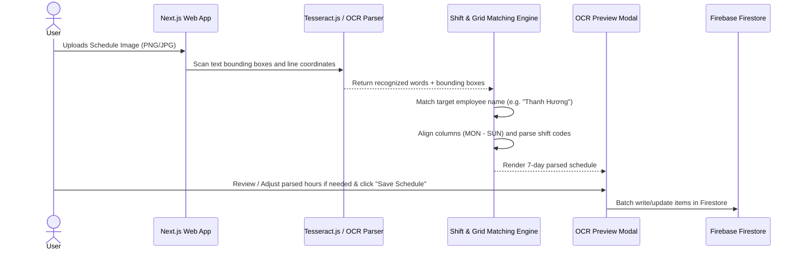

# OCR Schedule Import Feature Design Document

**Date:** 2026-07-27  
**Project:** `schedule-telegram-app`  
**Status:** Approved  

---

## 1. Overview
The **OCR Schedule Import** feature enables users to upload a photo/image of a weekly working schedule (e.g., Highlands Coffee weekly schedule board), automatically locate the row corresponding to their configured employee name (e.g., `"Thanh Hương"`), parse shift codes (`B18`, `B`, `A`, `11-18H`, `OFF`), preview the 7-day schedule, and save the batch schedule to Firebase Cloud Firestore.

---

## 2. Architecture & Data Flow

---

## 3. Key Components & Specifications

### 3.1 Settings Integration (`ScheduleSettings`)
- **Field Added:** `employeeName?: string` (e.g., `"Thanh Hương"`).
- **Location:** Stored in Firebase Firestore (`settings/config`) and rendered in `components/SettingsTab.tsx`.

### 3.2 OCR & Shift Parsing Logic (`lib/ocr-parser.ts`)
- **Tesseract.js Integration:** Client-side optical character recognition.
- **Name Matching:** Case-insensitive, diacritic-insensitive fuzzy line search to find the target row without relying on row number (`STT`).
- **Column Alignment:** Matches day headers (`MON`, `TUE`, `WED`, `THU`, `FRI`, `SAT`, `SUN`) to column X-coordinates.
- **Shift Code Rules:**
  - Standard predefined codes:
    - `B18` ➔ `18:00 - 22:00`
    - `B` ➔ `15:00 - 22:00`
    - `A` ➔ `07:00 - 15:00`
    - `A11` ➔ `07:00 - 11:00`
    - `OFF` ➔ (Off / No shift)
  - Dynamic range codes (Regex `^(\d{1,2})-(\d{1,2})H?$`):
    - `11-18H` ➔ `11:00 - 18:00`
    - `14-18H` ➔ `14:00 - 18:00`
    - `10-14H` ➔ `10:00 - 14:00`
    - `11-15H` ➔ `11:00 - 15:00`
    - `8-16H` ➔ `08:00 - 16:00`

### 3.3 UI Components
1. **Upload Trigger Button (`components/OcrUploadButton.tsx`):**
   - Placed on the main Schedule view with camera/upload icon `"📷 Import Lịch từ Ảnh"`.
2. **Preview Modal (`components/OcrPreviewModal.tsx`):**
   - Displays 7 cards corresponding to Mon - Sun.
   - Allows users to modify startTime, endTime, or toggle reminder before saving.
   - "Lưu vào Thời khóa biểu" button batch updates items via `/api/schedule`.

---

## 4. Error Handling
- **Name Not Found:** Display clear alert `"Không tìm thấy hàng chứa tên '${employeeName}' trong ảnh lịch"`.
- **Unrecognized Shift Code:** Render card with editable empty time fields in Preview Modal for manual input.
