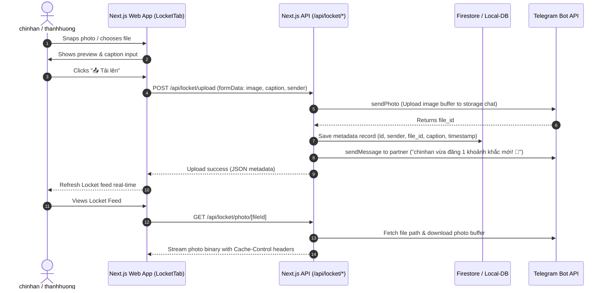

# Design Document: Locket Real-time Photo Sharing Feature

**Project**: `Quanly_LichlamTh`  
**Date**: 2026-08-03  
**Target Users**: `chinhan` & `thanhhuong`  
**Status**: Approved / Ready for Implementation  

---

## 1. Overview & Goals

This feature introduces a Locket-style real-time photo-sharing experience directly integrated into the `Quanly_LichlamTh` Next.js application. It allows `chinhan` and `thanhhuong` to capture and share live moments with each other.

### Key Highlights
- **Default App Tab**: The app opens directly to the Locket tab upon launch.
- **Telegram Bot Storage**: Leverages a Telegram Bot (`sendPhoto`) as an unlimited cloud media storage backend to keep photos without incurring storage fees or server space limits.
- **Hero Locket Feed**: Displays the latest shared moment in a prominent 1:1 square card with sender info, timestamp, caption, and HD photo download option.
- **Quick Camera & Explicit Upload**: Features an inline camera shutter button for instant snapping/file picker, followed by a preview screen with caption entry and an explicit **Upload** button.
- **Paginated History Feed**: Shows historical moments capped at 10 items per page with a "Load More" ("Tải thêm") button to avoid page lag.
- **Telegram Partner Notification**: Automatically sends a short Telegram notification message to the partner whenever a new moment is uploaded.

---

## 2. System Architecture & Data Flow



---

## 3. API & Database Specifications

### 3.1 Database Schema (`locket_photos` Collection / Local DB)
Each photo entry stores the following metadata:

```typescript
interface LocketPhoto {
  id: string;                  // Unique photo ID (e.g. loc_1722680000000)
  sender: string;              // Username: 'chinhan' | 'thanhhuong'
  telegram_file_id: string;    // Telegram Bot Photo File ID
  caption?: string;            // Optional short caption
  created_at: string;          // ISO 8601 Timestamp string
}
```

### 3.2 API Routes

#### 1. `POST /api/locket/upload`
- **Request**: `FormData` containing `file` (Buffer/Blob), `caption` (string, optional), `sender` (string).
- **Process**:
  1. Uploads file buffer via Telegram `sendPhoto` API.
  2. Extracts `file_id` from Telegram response.
  3. Saves `LocketPhoto` metadata record into Firestore / Local DB.
  4. Triggers Telegram message to partner's Chat ID.
- **Response**: `{ success: true, photo: LocketPhoto }`

#### 2. `GET /api/locket/feed`
- **Query Params**: `page` (number, default: 1), `limit` (number, default: 10).
- **Process**: Fetches `LocketPhoto` records sorted by `created_at` descending.
- **Response**: `{ success: true, photos: LocketPhoto[], total: number, hasMore: boolean }`

#### 3. `GET /api/locket/photo/[fileId]`
- **Query / Param**: `fileId` (Telegram file ID).
- **Process**: Retrieves image buffer from Telegram API using existing helper `downloadTelegramPhotoBuffer`.
- **Response**: Binary image response with `Headers`:
  - `Content-Type: image/jpeg` (or detected mime type)
  - `Cache-Control: public, max-age=86400, immutable`

---

## 4. UI/UX Component Specifications (`components/LocketTab.tsx`)

### Layout Components

1. **Top Locket Hero Frame (Latest Moment)**
   - Ratio: `aspect-square` (1:1 aspect ratio).
   - Sender avatar badge & relative time indicator ("5 phút trước").
   - Caption overlay at bottom.
   - HD Download button (`<a download href="/api/locket/photo/[fileId]">`) to save original photo.

2. **Quick Camera & Action Bar**
   - **"📸 Chụp Ảnh"**: Native web camera capture / HTML5 camera stream modal.
   - **"📁 Chọn Ảnh"**: Hidden file input trigger for library uploads.
   - **Preview Modal / Container**: Displayed after photo capture with:
     - Captured image preview.
     - Text input for caption.
     - **"📤 Tải lên"** button to confirm sending.

3. **History Moments Feed**
   - Grid layout (2 columns on mobile, 3-4 columns on desktop).
   - Each item displays: 1:1 image thumbnail, sender tag, time, and quick download icon.
   - Initial load: 10 items.
   - **"Tải thêm khoảnh khắc cũ"** button at bottom to load next page.

---

## 5. Non-Functional Requirements & Performance
- **Zero Bot Token Leakage**: All Telegram API requests are proxied via server API routes.
- **Performance Optimization**: 10 items per page pagination prevents browser memory bloat and DOM lag.
- **Image Caching**: HTTP `Cache-Control: public, max-age=86400` headers on photo proxy route to minimize repeated downloads.
- **Fallback DB Compatibility**: Fully compatible with both Firebase Firestore (`lib/firebase.ts`) and Local DB (`lib/local-db.ts`).

---

## 6. Implementation Checklist
- [ ] Create DB helpers in `lib/firebase.ts` & `lib/local-db.ts` for `locket_photos`.
- [ ] Create API route `app/api/locket/upload/route.ts`.
- [ ] Create API route `app/api/locket/feed/route.ts`.
- [ ] Create API route `app/api/locket/photo/[fileId]/route.ts`.
- [ ] Create `components/LocketTab.tsx` with 1:1 Hero frame, camera snap, preview, upload confirm, and history pagination.
- [ ] Update `app/page.tsx` to set `locket` as the default active tab.
- [ ] Run build & end-to-end verification.
